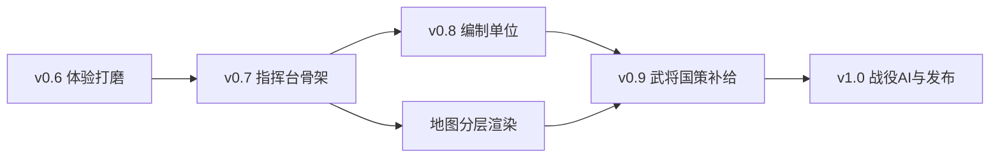

# 三国雄心 · 更新计划 v0.7 → v1.0

> **当前基线**：v0.6.0（Sprint A 体验打磨）  
> **本文档**：将编制单位、可移动单位、地图分层、大地图主导 UI 纳入中长期愿景，并重新编排版本路线。  
> **原则**：愿景可先落地文档与接口；实现按 Sprint 分批，不要求一次做完。

---

## 一、核心概念（愿景）

### 1.1 编制单位 vs 可移动单位

| 概念 | 说明 | 游戏内角色 |
|------|------|------------|
| **组成单位** | 编制上的编制块，不单独在大地图移动 | 百人队、千人队的「满编/缺编」状态 |
| **可移动单位** | 在大地图上有位置、可下达行军/战斗指令的最小实体 | 千人队（将领可率领的最小机动单位）及以上 |

**设计意图**：玩家操作的是「能动的部队」，但战损、募兵、整编发生在更细的编制层；避免「1 兵 = 1 个点」的抽象感，也为后续兵种、士气、溃散留接口。

### 1.2 编制层级

```
集团军 (ArmyGroup)
  └─ 任命元帅（将领职务，非编制本身）
  └─ 将军队 × N (Corps)
       └─ 任命将军（将领职务）
       └─ 千人队 × M (Battalion)  ← 将领可率领的最小「可移动单位」
            └─ 任命千人队队长（军官职务，≠ 将军）
            └─ 百人队 × 10 (Century)  ← 「组成单位」，不单独机动
                 └─ 满编 100 人；战损可降至缺编
```

**职务与编制分离（重要）**

| 职务 | 绑定对象 | 说明 |
|------|----------|------|
| 千人队队长 | 一个千人队 | 战术指挥；属性加成主要作用于本队 |
| 将军 | 一个将军队 | 可统辖多个千人队；将军队是大地图上的「军旗」实体 |
| 元帅 | 一个集团军 | 可统辖多个将军队；提供战役级加成与 AI 目标权重 |

同一将领不会「既是将军又是某千人队队长」——职务互斥，避免 HOI 师团堆叠的混乱感。

### 1.3 兵力与整编规则（草案）

- **募兵**：默认流入首都所在将军队的缺编百人队；无将军队时先建 1 个千人队再填编。
- **战损**：优先打残前排百人队，再向后蔓延；千人队人数 &lt; 500 时视为「残编」、行军速度 -20%。
- **合并**：同格同势力、同将军麾下两个未满编千人队可整编（消耗 1 游戏日或 24 小时）。
- **升格**：将军队下辖满编千人队 ≥ 3 且将军统率达标 → 可扩编为新的将军队（拆出一半千人队）。

### 1.4 地图分层（Overlay）

大地图同一套格网，**显示层**可切换（底栏右侧单选，默认「军情」）：

| 图层 ID | 名称 | 显示内容 | 备注 |
|---------|------|----------|------|
| `military` | 军情（默认） | 势力色、驻军、行军箭头、战斗态 | 当前 v0.6 行为 |
| `terrain` | 地形 | 平原/山地/河流高对比着色，弱化势力色 | |
| `resource` | 资源 | 粮产出热力、屯田标记、缺粮风险格 | 类似调试「打印详情」的数据可视化 |
| `political` | 归属 | 强调边界与占领时长 | 后续 Sprint |
| `supply` | 补给线 | 粮道是否通畅（依赖屯田与距离） | 与粮尽系统联动后启用 |

**规则**：底栏右侧筛选为 **单选**；切换图层不暂停时间；军情层以外的图层上仍可点击地块，但募兵/调兵按钮仅在军情层或可配置为「始终可用」。

---

## 二、UI 愿景：大地图主导

### 2.1 布局总览

```
┌─────────────────────────────────────────────────────────────┐
│ 顶栏（薄）  时间·势力·粮·城  │ 暂停 ×1×2×5 │ 存档 新游戏 [调试]… │  ← 调试收成按钮
├─────────────────────────────────────────────────────────────┤
│                                                             │
│                                                             │
│                      大 地 图（主内容区）                      │
│                   占满剩余宽高 · 可拖拽缩放                    │
│                                                             │
│              （所有弹窗/面板 z-index 高于地图）                 │
├─────────────────────────────────────────────────────────────┤
│ 底栏（加高，约 22～28vh 或 160～200px）                        │
│ ┌──────────┬────────────────────────────┬──────────────────┐ │
│ │ 小地图    │  将军队 / 集团军（可折叠）   │ 图层 [军情]地形… │ │
│ │ 视口框    │  树状或卡片列表 · 选中联动地图  │  单选筛选按钮    │ │
│ └──────────┴────────────────────────────┴──────────────────┘ │
└─────────────────────────────────────────────────────────────┘
```

### 2.2 顶栏

- **常驻**：`第 N 天 HH 时`、势力、粮、关键城数、速度、暂停、存档/读档/新游戏。
- **收纳为按钮**：调试（打开调试弹窗）、国策、事件日志、设置等——点击后以 **浮层** 形式叠在大地图之上，不占侧栏。
- **调试弹窗**：含原「清空/打印/复制/版本检查/日志筛选」；关闭后地图恢复全屏感。

### 2.3 底栏三区

| 区域 | 内容 | 交互 |
|------|------|------|
| **左：小地图** | 整图缩略 + 当前视口矩形 | 点击/拖拽跳转视口；与大地图双向同步 |
| **中：编制面板** | 将军队列表（可展开下辖千人队）；集团军列表（可收纳/展开将军队） | 选中将军队 → 地图高亮其驻地与行军线；右键或长按出命令（整编、任命） |
| **右：图层筛选** | 军情 / 地形 / 资源 / … | **单选**；默认军情；图标 + 短标签 |

### 2.4 弹窗规范

- 开局选势力、国策树、战斗结果、调试器等均为 **modal overlay**，背景半透明，居中或贴边抽屉。
- `z-index`：地图 &lt; 底栏 &lt; 顶栏 &lt; 弹窗 &lt; 全局 alert。
- 移动端：底栏可折叠为一条「展开指挥台」把手，进一步让出地图高度。

---

## 三、版本路线（重新编排）

### Phase 0 — 已完成

| 版本 | 内容 |
|------|------|
| v0.5 | 小时 Tick、玩家操控己方、视窗外 AI 精简 |
| v0.6 | Sprint A：势力弹窗、地图缩放、战斗动画、侧栏分块 |

---

### Phase 1 — v0.7「指挥台骨架」（UI 重构，不改编制逻辑）

**目标**：大地图主导布局就位，为编制与图层铺路。

| 项 | 交付 |
|----|------|
| 布局重构 | 顶栏薄条 + 地图 flex 1 + 加高底栏三区 |
| 调试收纳 | `[调试]` 按钮 → 弹窗内完整调试能力 |
| 小地图 | 缩略 Canvas + 视口框；点击定位 |
| 图层切换 UI | 底栏右侧单选按钮；先实现 `military` / `terrain` / `resource` 三档渲染分支 |
| 弹窗框架 | 统一 `ModalHost`：势力/国策/调试复用 |
| 响应式 | 窄屏底栏可折叠 |

**数据**：仍使用现有 `Army` 扁平结构；底栏中间暂显示「势力部队列表」占位，文案称「将军队（待整编）」。

**验收**：地图可视面积明显增加；调试不再占主界面；图层切换流畅、默认军情。

---

### Phase 2 — v0.8「编制单位」（数据与战斗）

**目标**：引入百人队 / 千人队 / 将军队 / 集团军，替换扁平 `Army`。

| 项 | 交付 |
|----|------|
| 类型定义 | `Century`、`Battalion`、`Corps`、`ArmyGroup`；职务字段 `commanderHeroId` |
| 存档迁移 | v0.7 存档：1 `Army` → 1 `Corps` + 1 `Battalion`（10 个满编 `Century`） |
| 战斗 | 战损按百人队扣减；千人队为战斗结算单位 |
| 机动 | 仅 `Battalion` 及以上可 `orderMarch`；队长/将军加成进公式 |
| 募兵/整编 | 募兵填入缺编百人队；同格整编 UI |
| 底栏中间 | 真实将军队树 + 集团军收纳 |

**配置**：`heroes.json` 增加 `command`（统率）、`maxCorps`（可带将军队数）等。

**验收**：存档迁移无损；地图上的可移动单位与编制树一致；将军 ≠ 千人队队长在 UI 上可区分。

---

### Phase 3 — v0.9「武将·国策·补给」

**目标**：完成原 Sprint B，并与编制、图层联动。

| 项 | 交付 |
|----|------|
| 武将 | 任命将军/队长/元帅；首都默认主将 |
| 国策树 | 3 分支 2～3 级；弹窗树状；互斥与前置 |
| 粮尽溃散 | `starvingDays` → 百人队溃散/降编 |
| 资源图层 | 粮产出/屯田/风险格热力 |
| 补给图层（可选） | 简单粮道连通着色 |

**验收**：缺粮时编制树变灰；资源图层与调试打印数值一致。

---

### Phase 4 — v1.0「战役 AI + 发布」

**目标**：可发布单机 + 可选云存档 + 移动端。

| 项 | 交付 |
|----|------|
| AI 战略层 | 集团军/将军队目标；视窗内战术 + 视窗外精简（延续 v0.5） |
| 难度 | 简单/普通/困难 |
| Supabase | 云存档与冲突处理 |
| Capacitor APK | 触控、返回键暂停 |
| PWA | 离线缓存 |

**验收**：见原 ROADMAP v1.0 五条发布标准；30 分钟内可分出胜负。

---

## 四、技术要点（实现备忘）

### 4.1 建议目录

```
src/
  core/
    organization/     # 编制：century, battalion, corps, army-group
    map-layers/       # 各图层 render 策略
  ui/
    shell/            # 顶栏、底栏、布局
    minimap.ts
    modal-host.ts
    corps-panel.ts    # 底栏编制树
    layer-switcher.ts
  map/
    render/           # 按图层拆 draw 函数
```

### 4.2 存档版本

| SAVE_VERSION | 变更 |
|--------------|------|
| 0.6.x | 扁平 `Army` + `hour` |
| 0.7.x | 布局无关；可选 `uiPrefs.layer` |
| 0.8.0 | `Corps` / `Battalion` / `Century` 树；迁移函数 `migrateArmiesToCorps` |
| 1.0.0 | 集团军、元帅、完整武将职务 |

### 4.3 与现有代码的衔接

- `gameHourTick`：Phase 2 起改为遍历 `Corps` 下属 `Battalion` 处理行军/战斗。
- `visibility.ts`：仍以地块 + 行军目标判断 AI 全量/精简。
- `buildArmyDisplay`：改为从 `Battalion` 生成 overlay；集团军/将军队旗标在军情层额外绘制。

---

## 五、优先级与依赖



**建议下次开发起点**：**Phase 1 / v0.7**（UI 壳 + 小地图 + 图层切换 + 调试弹窗），不阻塞当前可玩性，且与编制数据解耦。

---

## 六、原 Sprint B/C/D 对照

| 原路线图 | 新计划归属 |
|----------|------------|
| Sprint B 武将与国策 | Phase 3 / v0.9 |
| Sprint C AI 战略层 | Phase 4 / v1.0 |
| Sprint D 平台存档 | Phase 4 / v1.0 |
| （新增）编制体系 | Phase 2 / v0.8 |
| （新增）大地图 UI + 图层 | Phase 1 / v0.7 |

---

## 七、开放问题（后续拍板）

1. 集团军是否必须玩家手动组建，还是占关键城后自动升格？
2. 一个将军队最多辖几个千人队（硬顶 5？受将军统率影响？）
3. 资源图层是否显示精确数字，还是仅色阶？
4. 底栏小地图是否与主图共用同一 `GeneratedMap` 实例（推荐：是，双 Canvas）。

---

*文档版本：2026-06-17 · 基线 v0.6.0*
