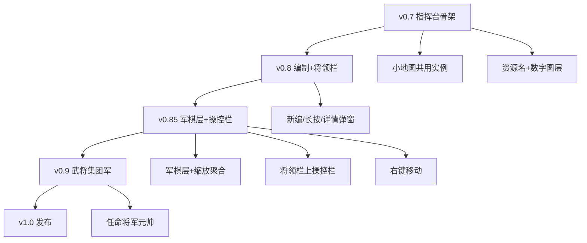

# 三国雄心 · 更新计划 v0.7 → v1.0

> **当前基线**：v0.8.0  
> **设计原则**：向钢铁雄心 4 取核心、去繁杂，重效率与性价比。  
> **本文档**：编制、UI、图层、**军棋层**、战斗经济的细致愿景 + 分 Phase 交付路线。

---

## 一、已拍板决策（原开放问题）

| 问题 | 决策 |
|------|------|
| 集团军组建 | **手动**；不占城自动升格 |
| 将军队辖千人队上限 | **10 个**（硬顶） |
| 资源图层 | 每格显示 **资源名称 + 对应数字**（非纯色阶） |
| 小地图 | 与主图 **共用同一 `GeneratedMap` 实例**，双 Canvas 渲染 |
| 千人队番号 | **自动编号**（如 1 队、2 队…），**不设队长职务** |
| 将领职务 | 仅 **将军**（将军队）、**元帅**（集团军）；职务互斥 |

---

## 二、编制体系（HOI4 简化版）

### 2.1 层级与性质

```
集团军 ArmyGroup          ← 手动组建；任命元帅；辖多个将军队
  └─ 将军队 Corps         ← 大地图「军」实体；任命将军；最多 10 个千人队
       └─ 千人队 Battalion  ← 最小可移动单位；自动番号；10 个百人队
            └─ 百人队 Century  ← 组成单位；满编 100；不单独机动
```

| 层级 | 可移动 | 大地图显示 | 玩家主要操作 |
|------|--------|------------|--------------|
| 百人队 | 否 | 不单独显示 | 编队详情、募兵填缺 |
| 千人队 | **是** | **军棋**（见 §五） | 行军、战斗、编入将军队 |
| 将军队 | 是（旗） | 军棋 + 军旗汇总 | 任命将军、收纳千人队 |
| 集团军 | 否（编制） | 可选战役区着色 | 手动组建、任命元帅、战役目标 |

**对齐 HOI4**：师（师团）≈ 千人队；军 ≈ 将军队；集团军 ≈ 集团军。  
**刻意不做**：师长级将领、旅级子编制、复杂编制模板编辑器。

### 2.2 番号规则

- 将军队内千人队按创建顺序自动编号：`1队`、`2队` … `10队`。
- 某队溃灭后 **不回收番号**（新队用下一个空闲号，最多到 10）。
- 番号仅用于 UI 与日志，无额外属性加成。

### 2.3 兵力与整编（精简）

| 规则 | 说明 |
|------|------|
| 募兵 | 流入将军队下辖 **缺编百人队**；优先首都所在将军队 |
| 战损 | 从接战百人队起向后扣；队归零视为溃散 |
| 残编 | 千人队 &lt; 500 人：行军 +20% 时间（与快军国策叠加前计算） |
| 同格合并 | 同将军队下两未满编千人队 → 整编（24 游戏小时，期间不可机动） |
| 编入将军队 | 见 **§四·将领栏** 长按并入；地图上孤立的己方千人队可并入待命将军队 |

### 2.4 集团军（手动）

- 顶栏或底栏 `[组建集团军]` → 弹窗勾选 ≥2 个将军队 → 确认 → 生成集团军条目。
- 可任命元帅（从己方将领列表）；元帅提供战役级攻防 +5%（数值可配）。
- 解散集团军：下属将军队回到「无集团军」状态，不删兵。
- AI 暂不自动建集团军（v1.0 前）。

---

## 三、UI 总布局（大地图主导）

```
┌──────────────────────────────────────────────────────────────────┐
│ 顶栏  第N天HH时·魏·粮·城 │ ×1×2×5 暂停 │ 存档 新游戏 [调试][国策][日志] │
├──────────────────────────────────────────────────────────────────┤
│ ┌─军队详情弹窗（左上，点击待命军队后出现）────────────────────┐  │
│ │ [将领固定栏] 任命将军 | 将军队名·驻地·总兵力              │  │
│ │ [千人队列表] 编队详情 1队 | 编队详情 2队 | …               │  │
│ └────────────────────────────────────────────────────────────┘  │
│                                                                  │
│                     大 地 图（flex:1，主内容）                     │
│                                                                  │
├──────────────────────────────────────────────────────────────────┤
│ 底栏（默认隐藏指挥区，点击「展开指挥台」拉高）                      │
│ ┌─────────┬──────────────────────────────────┬─────────────────┐ │
│ │ 小地图   │ [军队操控栏]（选中将军队时出现）    │ [军情]地形资源… │ │
│ │ 视口框   │ 将领栏（隐藏层，见 §四）            │ 单选图层        │ │
│ └─────────┴──────────────────────────────────┴─────────────────┘ │
└──────────────────────────────────────────────────────────────────┘
```

- 所有功能弹窗 `z-index` 高于地图，低于全局 alert。
- 小地图与主图 **同一 `GeneratedMap`**，独立小 Canvas 缩放绘制。

---

## 四、将领栏与军队编排（核心交互）

### 4.1 将领栏显示逻辑

- 底栏中间为 **将领栏**；**默认折叠隐藏**，仅露把手「展开指挥台」。
- 展开后显示一行（或多行）**待命军队按钮** + 最右侧 **「新编军队」** 按钮。

### 4.2 新编军队流程

1. 在大地图 **军情图层** 点选 **己方** 单位（千人队或将军队旗）。
2. 点击 **「新编军队」**：
   - 在按钮 **左侧** 插入一个 **待命军队** 按钮（代表一个新将军队槽位，初始收纳所选单位）。
   - 每再选一个己方单位再点一次，继续向左追加按钮。
3. **排满换行**：当前行无空位时，「新编军队」移到 **上一行**，叠在第一个待命军队按钮 **正上方**；将领栏 **增高**（多行网格，行高固定如 40px）。
4. 待命军队未绑定将军时，按钮文案：`将军队·待命` + 下属队数；有将军则显示将军名。

### 4.3 待命军队按钮交互

| 操作 | 效果 |
|------|------|
| **单击** | 在主图 **左上角** 打开 **军队详情弹窗**（不挡地图中心） |
| **长按**（≥500ms） | 若地图上已选中己方单位 → 将该单位 **编入** 此将军队（千人队归入列表；若选中的是将军队则合并编制，取较高番号继续编号） |

### 4.4 军队详情弹窗（单击待命军队）

**布局**：贴主图左上角，可拖拽；宽约 320px，最高 50vh 可滚动。

#### 固定栏 · 将领区（顶部，始终可见）

| 元素 | 行为 |
|------|------|
| 将军队名、驻地格、总兵力 | 只读 |
| `[任命将军]` | 打开 **将领列表弹窗**（叠在本弹窗之上） |

**将领列表弹窗**：

- 列出己方所有将领；已任命他处的加 **「已任命」** 标记。
- 未任命者：选中 → `[上任]`；当前将军队已有将军 → `[卸任]`。
- `[关闭]` 不做任何变更。

#### 滚动区 · 千人队列表

- 每行：`[编队详情]` + 番号标签（如 `3队 · 850人 · @许昌`）。
- 点击 **编队详情** → **编队详情弹窗**（见下）。

### 4.5 编队详情弹窗（某番号千人队）

| 区域 | 内容 |
|------|------|
| **左侧** | 10 个百人队块：满编/缺编/溃散（色块 + 每队人数）；部署位置（驻留格，与将军队同格或分行军态） |
| **右侧** | 编队统计：总人数、攻击/防御估算、地形适性（简化为平原/山地/河流修正表）、残编惩罚、行军剩余时间 |

- 无任命队长 UI；番号即标识。
- 行军中的队：左侧标注目标格与 ETA（小时）。

### 4.6 与地图联动

- 选中地图己方单位：高亮对应番号行（若已在某待命军队中）。
- 选中待命军队：大地图高亮该将军队驻地 + 所有下属千人队位置与行军线。
- 集团军视图（后续）：底栏增加「集团军」折叠页，手动勾选将军队入组；不替代将领栏。

### 4.7 将军队 / 集团军操控栏

在将领栏中 **选中** 一个 **将军队按钮** 或 **集团军按钮** 后：

1. 在 **将领栏外部、紧贴其上方** 出现一条 **军队操控栏**（与将领栏分离，不占用网格按钮位）。
2. 操控栏展示针对 **当前选中编制** 的快捷指令，例如：
   - `[训练]`：向选中将军队下辖缺编百人队补训（耗粮、耗时，见经济规则）
   - `[防御]` / `[驻守]`：选中编制在当前格 **筑壕/防御**（见 §五·战壕标识）
   - `[停止]` / `[取消行军]`（行军中时）
   - 后续 v0.9+：`[进攻]` 指向、集团军 `[战役目标]` 等
3. **未选中** 将领栏中的将军队/集团军按钮时，操控栏 **隐藏**。
4. 选中将军队时，大地图同步高亮该军所有千人队军棋；选中集团军时高亮辖内所有将军队驻地。

**与地图操作分工**：将领栏负责 **编制管理**（新编、编入、任命）；操控栏负责 **战术指令**（训练、防御、移动目标确认等）。

---

## 五、军棋层（大地图机动标识）

机动单位（千人队、将军队旗）在大地图上不以色块圆点表示，而以 **军棋**（Counter）—— HOI4 式 **横向长条矩形** 标识，与 **地图底图层**（地形 / 势力 / 资源）分离，渲染在 **底图之上、UI 弹窗之下**。

### 5.1 军棋形态（三区矩形）

```
┌──────────┬────────────────────────────┬────────┐
│  左区    │           中区              │  右区  │
│ 兵种图标 │  上：军队数（如 850）        │ 战壕   │
│ + 番号   │  下：组织度条 | 装备度条     │ 标识   │
│ (1队)    │  ████░░  ███░░░             │  ○ / ● │
└──────────┴────────────────────────────┴────────┘
```

| 区域 | 内容 | 说明 |
|------|------|------|
| **左区（整块）** | 兵种图标 + 番号 | 如步兵图标 + `1队`；将军队旗可用旗面/将军名缩写 |
| **中区（上下分层）** | 上层：军队总数；下层：组织度、装备度进度条 | 组织度/装备度 v0.9 可先占位条，数值后接战斗与经济 |
| **右区（整块）** | 战壕标识 | **移动中**：空心（未筑壕）；**驻守/筑壕后**：实心 |

- 矩形长宽比参考 HOI4 师级 counter；颜色取 **势力色** 为底，选中时描边高亮。
- **编制相同** 的判定（用于 §5.3 聚合）：同一 `Corps` 下辖、同兵种模板、同满编/残编档（可先简化为：同将军队 + 同 designation 档或同总兵力区间）。

### 5.2 渲染层级

```
z-order（自底向上）：
  1. 地图底图 Canvas（地形 / 势力染色 / 资源数字 — 随图层切换）
  2. 军棋层 Canvas（仅绘制军棋、行军连线、选中框；默认仅在「军情」图层激活，或军情模式下始终可见）
  3. 小地图、将领栏、弹窗、顶栏
```

- 军棋 **锚定在地块中心或格内偏移**，多队同格时 **纵向错开** 或略重叠，避免完全遮挡。
- 将军队 **军旗** 可绘制为放大版军棋或旗标 overlay，辖内千人队仍各有一枚军棋。
- 技术：`src/map/counter-layer.ts`（或 `map-layers/counter.ts`）独立模块；`buildCounterDisplay(save, zoom)` 与现有 `buildArmyDisplay` 衔接并逐步替代圆点 overlay。

### 5.3 缩放聚合（同类军棋合并显示）

地图 **缩小** 时，同一可视区域内、**编制相同** 的多枚军棋做 **数量叠加**，避免满屏 counter：

| 缩放档位 | 行为 |
|----------|------|
| **放大**（高 zoom） | 每格每队 **独立** 显示一枚军棋，显示完整三区信息 |
| **缩小**（低 zoom） | 在 **相邻** 且 **编制相同** 的军棋对中，**隐藏其一**，在保留的一枚军棋 **中区上层** 将 **军队数相加** 显示（如两枚 850 → 显示 1700） |
| **再次放大** | 恢复被隐藏的军棋，数字 **拆回** 各 counter |

**算法要点（草案）**：

1. 按当前 zoom 划分 **聚合半径**（格数或像素）。
2. 对玩家可见的 Battalions 按 `(corpsId, designation, understrengthFlag)` 分桶。
3. 桶内做 **空间聚类**（相邻格 / 距离 < 阈值）；每簇选 **代表格**（如兵力最大或最靠近簇心）保留军棋，其余标记 `aggregatedHidden`。
4. 代表军棋 `displayTroops = sum(簇内真实兵力)`；tooltip 可列出来源番号。
5. zoom 变化时 **debounce** 重算，避免每帧抖动。

**不做（P0）**：跨势力合并、不同编制强制合并、3D 堆叠动画。

### 5.4 大地图点击与移动（修订）

| 输入 | 平台 | 效果 |
|------|------|------|
| **短按 / 单击** | 触屏 / 鼠标左键 | **选中** 该格军棋（或该格唯一己方单位）；再次短按他处可改选 |
| **长按**（≥500ms） | 触屏 | 等价 **右键**：打开上下文（移动目标、驻守、取消等） |
| **右键单击** | 鼠标 | 若 **已选中** 单位且点击 **邻接格** → **下达移动**；否则选中/上下文（与 HOI4 左选右移一致） |
| **拖拽** | 可选 v1.0+ | 暂不实现画线进攻；仍 **点选目标格** |

- **修订现有行为**：v0.7～v0.8 的「选中 A 格再 **短按** 邻格 B 即移动」改为 **右键（或长按）到 B** 才移动；短按邻格仅 **改选** 或 **预览路径**。
- 将领栏 **长按编入** 逻辑不变（≥500ms 针对 **待命按钮**，非地图）。
- 实现：`map-viewport.ts` 区分 `pointerdown/up` 时长；桌面 `contextmenu` 映射移动指令。

---

## 六、地图图层

底栏右侧 **单选**，默认 **军情**。

| 图层 | 每格显示 | 对齐 HOI4 |
|------|----------|-----------|
| **军情** | 势力色、单位、箭头、战斗 | 默认战略图 |
| **地形** | 地形类型名（原野/山地/河畔） | 地形模式简化 |
| **资源** | **资源名 + 数字**，如 `粮 2.0/日`、`粮 4.0/日(屯田)` | 类似资源地图但只保留粮 |

资源层数字来源与 `economy.ts` 产出公式一致，避免与调试打印偏差。

**不做**：多资源矿脉、工业、人力（三国 P0 仅粮）。

---

## 七、小地图

- 共用 `GeneratedMap` + `save` 状态；`minimap.ts` 内 `scale = min(w,h) / mapPixelSize`。
- 绘制：势力色块缩略 + 视口矩形 + 选中将军队驻地闪烁点。
- 点击小地图 → 主图 `scrollTo` 对应中心；主图拖动 → 视口框实时更新。

---

## 八、HOI4 对齐取舍表

| HOI4 概念 | 本作 | 取舍说明 |
|-----------|------|----------|
| 师/旅编制 | 千人队/百人队 | 保留两级，去掉旅长 |
| 军/集团军 | 将军队/集团军 | 集团军仅手动 |
| 将领特质技能 | 攻/防/统率 3 项 | 不做技能树 |
| 战线 / 进攻线 | 点选邻格进军 | 不做画线；点目标格即行 |
| 计划作战 | 无 | v1.0 不做 |
| 补给网 | 粮耗 + 缺粮溃散 | 不做铁路、港口 |
| 工厂 / 贸易 | 屯田 | 单资源 |
| 情报迷雾 | 无 | 全图可见，减开发量 |
| 政治 / 外交 | 无 | 三方混战 |
| 科研 | 国策树 8～12 节点 | 代替科技树 |
| 空军海军 | 无 | 陆战 only |
| 师图标 / counter | **军棋** 三区矩形 | 见 §五；替代圆点兵力 |
| 战场宽度 | 每格单战场 | 同格多队自动合战 |

---

## 九、战斗 · 经济 · AI（细化）

### 8.1 战斗

- **接战单位**：以 **千人队** 为结算单元；同格同势力多队先合并战力或逐队轮战（v0.8 采用 **合并战力一次结算**，省性能）。
- **公式**：沿用现有 `resolveBattle`，将军 `attack/defense` 加成作用于将军队全队。
- **时长**：72 游戏小时；战斗中不可再行军。
- **结果**：更新百人队人数 → 刷新编队详情；溃灭从将军队列表移除该番号。

### 8.2 经济

- 产粮：按格 `粮 X/日`；资源图层只显示粮。
- 耗粮：按 **百人队** 数 × 0.5/日（与现逻辑一致，改为遍历编制树计数）。
- 募兵：20 粮 → 100 人填入指定将军队最缺编百人队；无将军队时提示先「新编军队」。

### 8.3 AI（分阶段）

| 阶段 | 行为 |
|------|------|
| v0.5 已有 | 视窗外 6h 精简；玩家势力不控 |
| v0.9 | AI 将军队级进攻；将军由配置表绑定 |
| v1.0 | 可选手动集团军 + 元帅；AI 战役目标 1 个方向 |

**不做**：AI 微操每个百人队。

---

## 十、版本路线（修订）

### Phase 0 ✅ v0.5～v0.6

小时 Tick、AI 视距、势力弹窗、缩放、战斗动画、侧栏分块。

---

### Phase 1 — v0.7「指挥台骨架」✅

| 交付 | 说明 |
|------|------|
| 全屏布局 | 顶栏 + 地图 flex1 + 可折叠底栏 |
| 调试/国策/日志 | 收成顶栏按钮弹窗 |
| 小地图 | 共用 map 实例 + 视口框 |
| 图层 UI | 军情/地形/资源单选；资源层 **名称+数字** |
| ModalHost | 统一弹窗栈 |
| 将领栏原型 | 新编军队、待命按钮、排满换行、左上详情浮层 |

---

### Phase 2 — v0.8「编制数据 + 将领栏」✅

| 交付 | 说明 |
|------|------|
| 数据模型 | `Century` / `Battalion` / `Corps` / `ArmyGroup`；番号；将军 `heroId` |
| 迁移 | 1 旧 `Army` → 1 `Corps` + N 队 + 10 百人队 |
| 将领栏完整交互 | 新编/排满换行/长按编入/单击详情 |
| 军队详情 + 编队详情弹窗 | §四 MVP |
| 战斗/行军 | 千人队机动；战损落百人队 |
| 上限 | 将军队最多 **10** 千人队 |

---

### Phase 2.5 — v0.85「军棋层 + 操控栏 + 输入修订」

| 交付 | 说明 |
|------|------|
| 军棋 Canvas 层 | §5.1 三区矩形；底图之上独立层 |
| 战壕标识 | 移动空心 / 驻守实心（§5.1 右区） |
| 缩放聚合 | §5.3 同类编制相邻合并兵力显示 |
| 输入修订 | 短按选中；**右键或长按** 移动（§5.4） |
| 军队操控栏 | §4.7 选中将军队/集团军后，将领栏上方 `[训练][防御]…` |
| 组织度/装备度 | 可先 UI 占位条，数值 v0.9 接战斗 |

---

### Phase 3 — v0.9「武将 · 国策 · 集团军」

| 交付 | 说明 |
|------|------|
| 任命将军/元帅 | 将领列表弹窗完整 |
| 集团军 | **手动**组建 UI + 元帅任命 |
| 国策树 | 弹窗树状 |
| 粮尽溃散 | 百人队流失 |
| 资源层数据 | 与 economy 完全一致 |

---

### Phase 4 — v1.0「发布」

AI 将军队/集团军目标、难度档、Supabase、APK、PWA；验收 30 分钟可局终。

---

## 十一、技术要点

### 11.1 目录

```
src/
  core/organization/     # century, battalion, corps, army-group, numbering
  core/map-layers/       # terrain, resource renderers（底图）
  map/counter-layer.ts   # 军棋层：三区矩形、聚合、战壕态
  ui/shell/              # top-bar, bottom-bar, layout
  ui/shell/corps-command-bar.ts  # 将领栏上方：训练/防御等
  ui/minimap.ts
  ui/modal-host.ts
  ui/corps-bar.ts
  ui/corps-detail.ts
  ui/battalion-detail.ts
  ui/layer-switcher.ts
  ui/map-viewport.ts     # 短按/长按/右键分工
```

### 11.2 存档版本

| SAVE_VERSION | 变更 |
|--------------|------|
| 0.7.x | `uiPrefs`：底栏展开、图层、弹窗位置 |
| 0.8.0 | `corps[]` 树；移除扁平 `armies` |
| 0.85.0 | 军棋层字段：`dugIn`、`organization`、`equipment`；`uiPrefs.mapZoom` |
| 0.9.0 | `armyGroups[]`、元帅 |
| 1.0.0 | AI 战役字段 |

### 11.3 关键类型（草案）

```typescript
interface Century {
  index: number       // 0..9 队内序号
  troops: number      // 0..100
}

interface Battalion {
  id: string
  designation: number // 番号 1..10
  centuries: Century[]
  tileId: string
  march?: MarchState
  inCombat?: boolean
  dugIn?: boolean       // 驻守/筑壕 → 军棋右区实心
  organization?: number // 0..100 → 中区进度条
  equipment?: number    // 0..100 → 中区进度条
}

interface Corps {
  id: string
  name?: string
  heroId?: string     // 将军；可选
  battalionIds: string[]
  tileId: string      // 军旗所在格（通常与主力同格）
  standby: boolean    // 将领栏待命槽
}

interface ArmyGroup {
  id: string
  heroId?: string     // 元帅
  corpsIds: string[]
}
```

### 11.4 衔接现有代码

- `gameHourTick` → 遍历 `Battalion` 处理行军/战斗。
- `buildCounterDisplay` → 替代 `buildArmyDisplay` 圆点 overlay，输出军棋矩形 + 聚合态。
- `playerCanAct` → 格归属 + 选中编制是否属玩家势力。
- `map-viewport` → 短按选中、右键/长按移动（§5.4）。

---

## 十二、依赖关系



**下一开发起点**：v0.85（军棋层 + 缩放聚合 + 右键移动 + §4.7 操控栏）。

---

## 十三、验收清单（编制/UI）

- [ ] 选中己方单位 → 新编军队 → 左侧出现待命按钮；连点多次多按钮
- [ ] 排满后新编按钮升至上一行，将领栏增高
- [ ] 将领栏默认隐藏，可展开
- [x] 长按待命按钮 + 已选地图单位 → 编入成功（v0.8）
- [x] 单击待命 → 左上军队详情；任命将军可上任/卸任（v0.8）
- [x] 编队详情见 10 百人队与右侧统计（v0.8）
- [ ] 军棋三区矩形：番号、兵力、组织/装备条、战壕空心/实心
- [ ] 军棋层在底图之上；军情图层下可见
- [ ] 缩小地图时相邻同类军棋合并兵力；放大恢复
- [ ] 短按选中；右键（或触屏长按）向邻格移动
- [ ] 选中将军队/集团军 → 将领栏上方出现操控栏（训练、防御等）
- [ ] 资源图层每格「粮 X/日」与调试一致
- [ ] 小地图与主图同步

---

*文档版本：2026-06-17 rev.3 · 基线 v0.8.0 · 新增 §五 军棋层、§4.7 操控栏*
